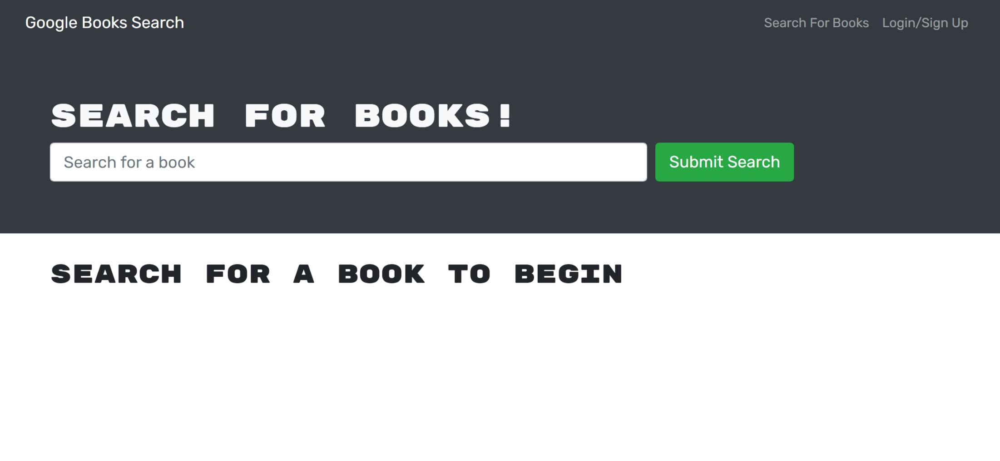

# byte-book-search-engine

Refactored book search engine. I added GraphQL API and Apollo Server to the existing MERN app. Starter code was provided by the Rutgers Coding Bootcamp.

## Installation

1. Clone the repo
2. Install dependencies
3. Run the app

## Deployed App at Heroku:

[deployed app](https://afternoon-oasis-76908.herokuapp.com/)

## Photo of the app:

## Technologies Used

- React
- Node
- Express
- MongoDB
- Mongoose
- GraphQL

## License

This project is licensed under the MIT License

## Contributing

I'm not taking contributions at this time.

## Credits

- [Rutgers Coding Bootcamp](https://bootcamp.rutgers.edu/coding/)
- [React](https://reactjs.org/)
- [Node](https://nodejs.org/en/)
- [Express](https://expressjs.com/)
- [MongoDB](https://www.mongodb.com/)
- [Mongoose](https://mongoosejs.com/)
- [GraphQL](https://graphql.org/)
- [Heroku](https://www.heroku.com/)
